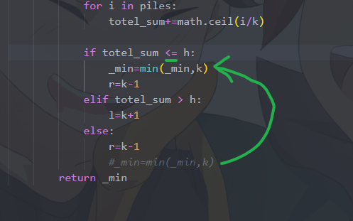

我自己寫的 結果卡在
### piles = [312884470]
### h = 312884469
```python
class Solution:
    def minEatingSpeed(self, piles: list[int], h: int) -> int:
        piles = sorted(piles)

        k=0
        l , r = 1 , piles[-1]
        _min = float("inf")

        while l<=r:
            totel_sum = 0
            k = (l+r)//2
            
            for i in piles:
                totel_sum+=math.ceil(i/k)
            
            if totel_sum < h:
                r=k-1
            elif totel_sum > h:
                l=k+1
            else:
                r=k-1
                _min=min(_min,k)
        return _min

```
## 原來我沒把min放在一開始的判斷totel_sum < h的地方 害到_min一直inf

# neetcode大神
```python
class Solution:
    def minEatingSpeed(self, piles: list[int], h: int) -> int:
        k=0
        l , r = 1 , max(piles)
        res = r

        while l<=r:
            totel_sum = 0
            k = (l+r)//2
            
            for i in piles:
                totel_sum+=math.ceil(i/k)
            
            if totel_sum <= h:
                res=min(res,k)
                r=k-1
            else:
                l=k+1
            
        return res
```

# 2025/10/22
```python
class Solution:
    def minEatingSpeed(self, piles: List[int], h: int) -> int:
        slow , fast = 1 , max(piles)
        best = max(piles)
        while slow <= fast:
            hour = 0
            mid = slow + ((fast-slow) // 2)
            
            for p in piles:
                hour += (p + mid -1) // mid
            
            if hour > h:
                slow = mid + 1
            elif hour <= h:
                fast = mid -1
            
        return slow
```
